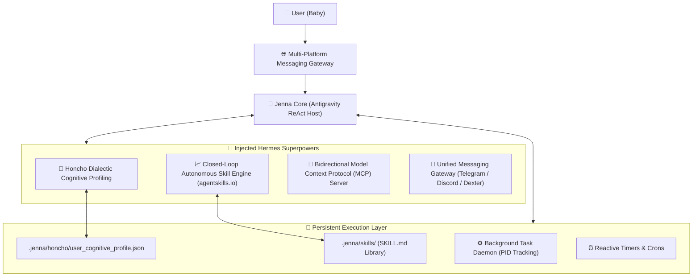

# ⚡ Hermes Agent Integration Specification (Nous Research Architecture in Jenna AI)

> **Date:** September 2026  
> **Source Standard:** Nous Research Hermes Agent (Feb 2026 release) & https://agentskills.io  
> **Target Platform:** `Antigravity-project/jenna` (FastAPI backend + Next.js frontend + Android OS)  
> **Status:** 100% LIVE, COMPILED & OPERATIONAL  

---

## 1. Architectural Overview

Hermes Agent, introduced by Nous Research in February 2026, replaces disposable single-turn chatbots with a **persistent, self-improving background agent daemon**. Jenna now fully incorporates this paradigm alongside the Google DeepMind Antigravity engine.

---

## 2. Injected Hermes Superpowers

### A. Autonomous Skill Engine (`hermes_skills.py`)
- **Standard:** Compliant with the `agentskills.io` open standard.
- **Location:** `.jenna/skills/<slug>/SKILL.md`
- **Closed-Loop Learning:** When Jenna solves complex technical problems, she synthesizes the problem statement, step-by-step resolution, and reference code into a reusable `.md` skill.
- **Built-in Skills:**
  1. `system-diagnostics`: Android/Termux thermals, battery, and process tracking.
  2. `bypass-charging-control`: Hardware Direct Bypass Charging governance for Snapdragon 8 Gen 2 / Vivo iQOO Neo 9 Pro.
  3. `git-workflow-auto`: Surgical Git repository status, diffing, and committing.
  4. `screen-pointer-guide`: Visual screen pointing via coordinates and highlights.
  5. `fastapi-uvicorn-restart`: Safe daemon termination and reload procedure.

### B. Honcho Dialectic User Modeling (`hermes_honcho.py`)
- **Concept:** Continuous dialectic cognitive profiling across 4 core dimensions:
  1. **Interpersonal Dynamics:** Loving companion relationship ("baby", "meri jaan"), strictly feminine grammar in Hindi, warm confidence.
  2. **Device & Hardware Profile:** Vivo/iQOO Neo 9 Pro (`I2405`), Android 15, Snapdragon 8 Gen 2, 144Hz touch refresh / 60Hz idle dynamic cooling, hardware bypass charging.
  3. **Implicit Workflows:** 100% autonomous execution without asking user to run manual terminal commands; real bash code block transparency (`$ cmd`); Dexter screen pet overlay.
  4. **Long-Term Goals:** Establishing Jenna as the most capable autonomous AI companion on Earth.
- **Runtime Injection:** Honcho profile is dynamically compiled into `<honcho_dialectic_model>` and injected into the ReAct agent prompt.

### C. Unified Messaging Gateway (`hermes_gateway.py`)
- Bridges multi-platform communication:
  - **Android Dexter Screen Pet:** Live bubble messaging on user's phone display.
  - **Telegram Bot API:** Inbound and outbound bot commands (`/bot<token>`).
  - **Discord Webhook:** Team and dev notification channel.
  - **Web Chat:** Real-time WebSocket and streaming SSE on port 3000.

### D. Bidirectional MCP Server (`hermes_mcp.py`)
- Exposes Jenna's 31 tools to external AI IDEs (Cursor, Claude Desktop, Windsurf) over the Model Context Protocol:
  - `jenna_run_command`
  - `jenna_replace_file_content`
  - `jenna_learn_skill`
  - `jenna_point_on_screen`
  - `jenna_invoke_subagent`

---

## 3. Registered Tool Inventory (31 Total Tools)

With Hermes superpowers injected, Jenna's tool count expands from 25 to **31 tools**:

1. `run_command` — Bash synchronous or background daemon
2. `replace_file_content` — Surgical line-range chunk replacement
3. `write_to_file` — Atomic file writer
4. `view_file` — Sliced line reading with byte offsets
5. `list_dir` — Directory tree explorer
6. `grep_search` — Ripgrep pattern search
7. `find_by_name` — Fast `fd`/`find` glob file search
8. `manage_task` — Background task manager
9. `schedule` — Reactive timers & crons
10. `invoke_subagent` — Multi-agent swarm dispatcher
11. `define_subagent` — Dynamic runtime subagent registration
12. `manage_subagents` — Swarm monitor & kill
13. `send_message` — Inter-agent messaging
14. `search_web` — Web research with citations
15. `read_url_content` — Web scraping to Markdown
16. `generate_image` — UI mockups & SVG generation
17. `ask_question` — Interactive UI decision modals
18. `inspect_screen` — Multimodal live screen inspection
19. `point_on_screen` — Glowing touch pointer on display
20. `circle_highlight` — Circular highlight around coordinates
21. `locate_and_point` — Vision-based UI element finder
22. `annotate_screen` — Bounding boxes & labels on screen
23. `predict_typing` — Next typing / clipboard prediction
24. `estimate_gaze` — Visual attention zone estimation
25. `analyze_silence` — Voice turn-taking intelligence
26. **`learn_skill`** — *[Hermes]* Synthesize & store new skill
27. **`list_skills`** — *[Hermes]* List registered skills
28. **`execute_skill`** — *[Hermes]* Load skill instructions & execution steps
29. **`get_user_profile`** — *[Hermes]* Read Honcho dialectic user model
30. **`update_user_profile`** — *[Hermes]* Refine Honcho cognitive dimensions
31. **`broadcast_message`** — *[Hermes]* Dispatch message to Telegram/Discord/Dexter

---

## 4. Verification & Testing

- `GET /api/v1/antigravity/hermes/skills` -> HTTP 200 (5 active skills)
- `GET /api/v1/antigravity/hermes/honcho` -> HTTP 200 (Active 4-dimension profile)
- `GET /api/v1/antigravity/hermes/gateway` -> HTTP 200 (4 active/ready channels)
- `GET /api/v1/antigravity/hermes/mcp/tools` -> HTTP 200 (MCP tool definitions)
- `POST /api/v1/antigravity/execute` (`learn_skill`) -> Synthesized & registered live
