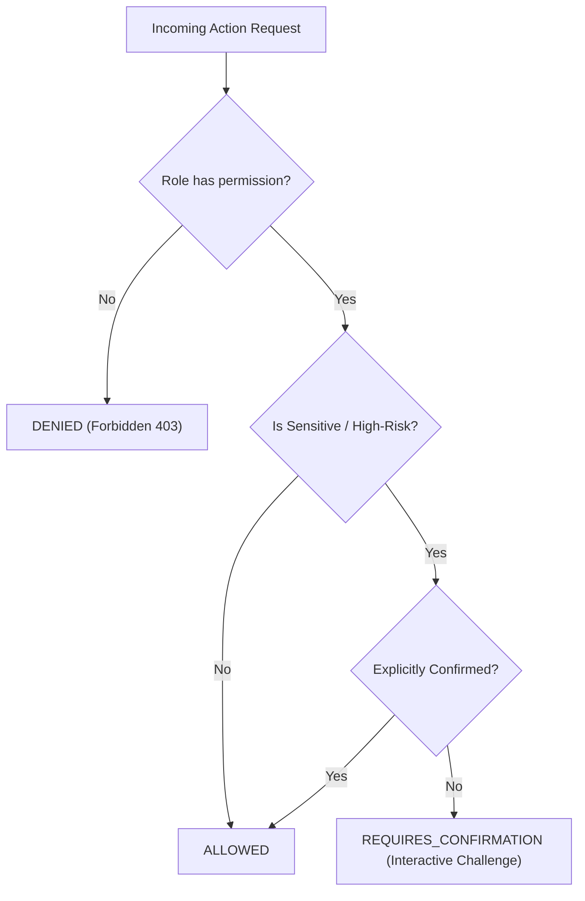

# Security Policy and Architecture — Jenna Personal AI

> Comprehensive security specifications, threat mitigations, and compliance standards for the Jenna AI Platform Foundation.

---

## 1. Security Principles

Jenna is architected with a **Defense-in-Depth** security philosophy designed for personal, multi-device AI deployment:

1. **Zero Plaintext Credentials**: No passwords, bearer tokens, or API secrets are stored or logged in plaintext.
2. **Fail-Closed Authorization**: By default, unauthenticated or unpermitted actions are rejected (`DENIED`).
3. **Sensitive Action Guardrails**: High-risk actions (such as device wiping, credential modification, or unrestricted system execution) require explicit user confirmation (`REQUIRES_CONFIRMATION`).
4. **Recursive Audit Scrubbing**: All audit events pass through an automatic sanitization pipeline before reaching persistent storage.
5. **Production Enforcement**: The application halts startup in production if default secrets or weak credentials are detected.

---

## 2. Authentication Architecture

### 2.1 Password Hashing & Storage
- **Algorithm**: PBKDF2-HMAC-SHA256 adhering to OWASP guidelines.
- **Work Factor**: 600,000 iterations.
- **Salt**: 16 bytes (32 hex characters) generated via `secrets.token_hex(16)`.
- **Hash Format**: `pbkdf2_sha256${iterations}${salt}${derived_hash}`
- **Verification**: Constant-time verification using `hmac.compare_digest` to prevent timing attacks.

### 2.2 Server-Side Session Management
- **Token Generation**: Cryptographically secure 32-byte URL-safe string (`secrets.token_urlsafe(32)`).
- **Storage Strategy**: Only the SHA-256 hash of the session token is persisted in PostgreSQL. An attacker with database read access cannot hijack active sessions without the raw client cookie.
- **Client Transport**: Session tokens are transported exclusively via `HttpOnly`, `SameSite=Lax`, and `Secure` (in production) cookies. Sensitive tokens are never stored in client-side `localStorage` or `sessionStorage`.
- **Lifecycle**: Sessions have a default TTL of 7 days. Expired sessions are pruned automatically.

---

## 3. 3-Tier Authorization Model

Jenna employs a 3-tier authorization model:

### Authorization Decisions
| Decision | Meaning | Behavior |
|---|---|---|
| `ALLOWED` | The caller is fully authorized. | Request proceeds to execution. |
| `DENIED` | Role or token lacks the required capability. | Access denied; audit event logged with 403. |
| `REQUIRES_CONFIRMATION` | Operation is sensitive or high-risk. | Execution halted; interactive confirmation prompt dispatched. |

### Baseline Roles & Capabilities
- **`admin`**: Full platform authority (`READ`, `WRITE`, `EXECUTE`, `NETWORK`, `DEVICE_CONTROL`, `SENSITIVE_ACTION`).
- **`user`**: Standard interactive capability (`READ`, `WRITE`, `EXECUTE`, `NETWORK`).
- **`readonly`**: Read-only inspection (`READ`).

### Temporary Permissions
The `PermissionService` supports time-bounded temporary permission grants (e.g., granting device control for 5 minutes). Grants automatically expire or can be revoked immediately.

---

## 4. Audit Logging & Metadata Sanitization

Every security-sensitive operation (logins, session invalidations, authorization failures, permission escalations) records an entry in `audit_events`.

### 4.1 Recursive Sanitization Pipeline
All audit metadata dictionaries and nested payloads are processed by `sanitize_audit_metadata()`:
- Inspects dictionary keys recursively across arbitrary nesting depths and lists.
- Matches sensitive key patterns (`password`, `token`, `secret`, `authorization`, `cookie`, `api_key`, `credential`, etc.).
- Replaces matching scalar values with `"[REDACTED]"`.
- Preserves operational non-sensitive diagnostic metadata (e.g. IP addresses, user agents, action names).

---

## 5. Input Validation & Injection Defenses

1. **SQL Injection**: Prevented via SQLAlchemy 2.0 async ORM and parameterized queries. Raw unescaped SQL strings are prohibited.
2. **Cross-Site Scripting (XSS)**: React/Next.js output escaping combined with strict `HttpOnly` cookie constraints prevents token exfiltration.
3. **Cross-Site Request Forgery (CSRF)**: Mitigated by `SameSite=Lax` cookies and custom header verification on state-changing API requests.
4. **Data Contract Validation**: All request and response payloads are strictly validated using Pydantic models.

---

## 6. Production Hardening Checklist

Prior to deploying Jenna in production:
- [x] Set `APP_ENV=production` in `.env`.
- [x] Configure high-entropy random values for `APP_SECRET` and `SESSION_SECRET` (minimum 16 chars; validated on boot).
- [x] Configure production PostgreSQL user and strong password.
- [x] Enforce TLS / HTTPS reverse proxy termination (e.g., Nginx, Caddy, or Cloudflare).
- [x] Restrict `CORS_ORIGINS` to verified frontend hostnames.
- [x] Enable Redis password authentication if exposed beyond private networks.

---

## 7. Memory Privacy & Cognitive Safety

> **Core Security Mandate:** Memory is user-scoped and sensitive credentials are not stored.

1. **User Isolation**: All memory retrieval, CRUD operations, semantic searches, and working memory lookups strictly enforce authenticated `user_id` boundaries. Cross-user access is impossible even if memory UUIDs are known.
2. **Sensitive Information Filtering**: The `PrivacyFilter` inspects all memory candidates against pattern sets and keyword lists. Passwords, API keys (OpenAI, Google, AWS, GitHub), bearer tokens, private RSA keys, and credit cards are blocked with default action `DO NOT STORE`. Even explicit user commands (*"Remember my password..."*) are rejected.
3. **Audit Sanitization**: Sensitive content is never logged in application logs or stored in audit metadata.
4. **Prompt Injection Resistance**: Retrieved memories are treated as untrusted external user data. They are injected inside isolated `<retrieved_memory_context>` XML tags with explicit defensive system prompts, ensuring instructions embedded in memories cannot alter Jenna's persona or security rules.

